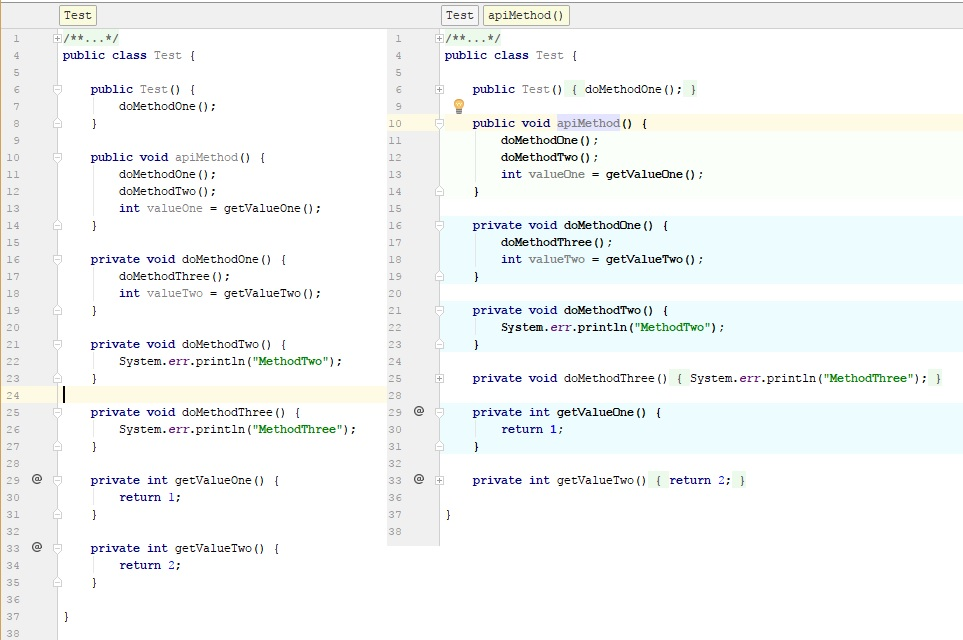

# IntellijMethodHierarchyHighlighter
Plugin to easier grasp the method call hierarchy in a JAVA class.

The usability is not greate at the moment. You have to press Ctrl+Alt+A
to test it. Also the colors are not configurable. It's more or less
a prototype :)

